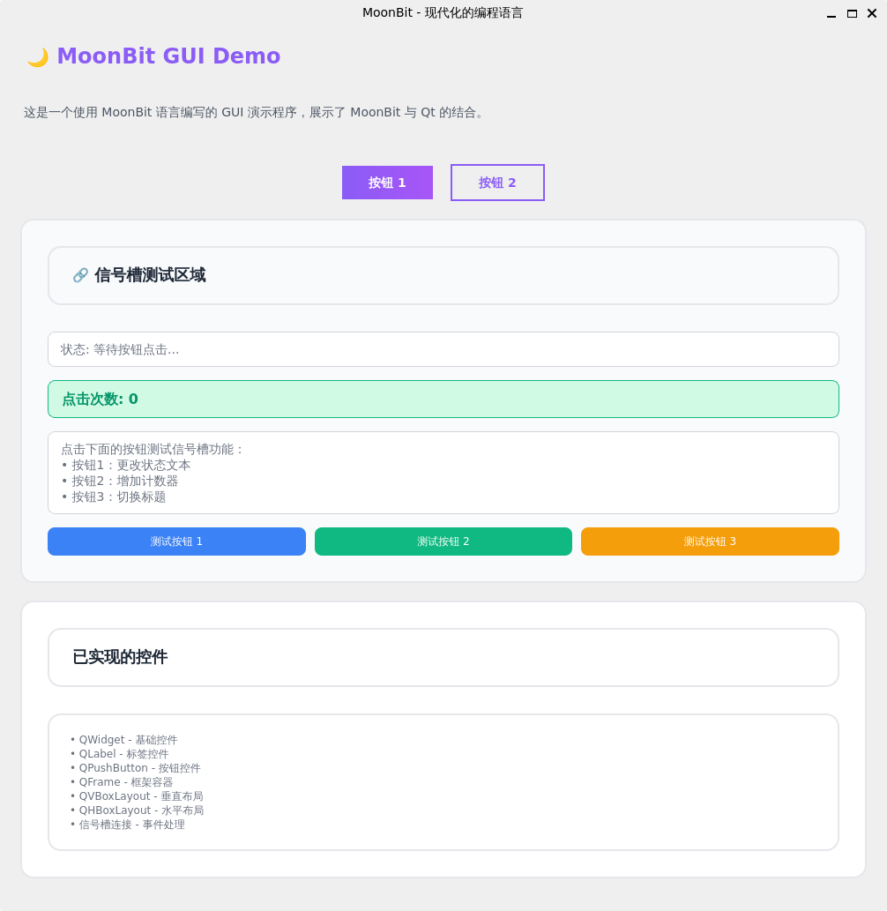

# 🌙 MoonBit Qt GUI 控件库

这是一个为 MoonBit 语言设计的 PySide6/Qt GUI 控件库，通过 FFI 实现了 MoonBit 与 Python Qt 框架的互通。

## 📋 项目结构

```
qtgui/
├── interpreter/                 # Python 环境配置
│   ├── .env_qt_python/         # Python 虚拟环境
│   ├── requirements.txt        # Python 依赖列表
│   └── README.md              # Python 环境设置指南
├── src/                        # MoonBit 源代码
│   ├── moonbit_gui_demo/      # GUI 演示应用
│   │   ├── main.py            # 主演示程序
│   │   ├── font_utils.py      # 字体工具
│   │   ├── test_*.py          # 测试文件
│   │   └── requirements.txt   # 演示依赖
│   ├── *.mbt                  # MoonBit 控件实现
│   └── signal_slot_manager.py # 信号槽管理器
├── .mooncakes/                 # MoonBit 包缓存
├── target/                     # 构建输出
└── README.md                   # 项目文档
```

## 🔧 环境配置

### Python 环境设置

在开始使用之前，请先配置 Python 环境：

1. **查看详细配置指南**：[interpreter/README.md](interpreter/README.md)
2. **快速设置**：
   ```bash
   cd .mooncakes/WilliamZ1008/qtgui/interpreter
   python3 -m venv .env_qt_python
   source .env_qt_python/bin/activate
   pip install -r requirements.txt
   ```

### 系统要求

- **MoonBit** 语言环境
- **Python 3.8+** 
- **PySide6 6.9.0**
- **Kaida-Amethyst/python** 包

## 📋 支持的控件

### 基础控件
- **QWidget** - 所有控件的基类
- **QLabel** - 标签控件
- **QPushButton** - 按钮控件
- **QLineEdit** - 单行文本输入框
- **QTextEdit** - 多行文本编辑器
- **QTextBrowser** - 富文本浏览器

### 选择控件
- **QCheckBox** - 复选框
- **QRadioButton** - 单选按钮
- **QComboBox** - 下拉选择框

### 数值控件
- **QSlider** - 滑块控件
- **QProgressBar** - 进度条

### 容器控件
- **QTabWidget** - 标签页控件
- **QMainWindow** - 主窗口
- **QFrame** - 框架容器
- **QScrollArea** - 滚动区域

### 布局管理器
- **QVBoxLayout** - 垂直布局
- **QHBoxLayout** - 水平布局

### 图像和显示
- **QPixmap** - 图像处理

## 🚀 快速开始

### 1. 环境准备

```bash
# 添加库依赖
moon add WilliamZ1008/qtgui

# 配置 Python 环境
cd .mooncakes/WilliamZ1008/qtgui/interpreter
python3 -m venv .env_qt_python
source .env_qt_python/bin/activate
pip install -r requirements.txt
cd ..
```

### 2. 基本用法

```moonbit
typealias @qtgui.Sys as Sys
typealias @qtgui.QApplication as QApplication
typealias @qtgui.QMainWindow as QMainWindow
typealias @qtgui.QLabel as QLabel
typealias @qtgui.QPushButton as QPushButton

fn main() {
  let sys = Sys::new()
  let app = QApplication::new(sys.argv())
  
  let window = QMainWindow::new()
  window.set_geometry(100, 100, 400, 300)
  
  let label = QLabel::new("Hello, MoonBit!", window)
  label.setGeometry(50, 50, 200, 30)
  
  let button = QPushButton::new("点击我", window)
  button.setGeometry(50, 100, 100, 30)
  
  window.show()
  sys.exit(app.exec())
}
```

### 3. 运行示例



```moonbit
typealias @qtgui.Sys as Sys
typealias @qtgui.QApplication as QApplication
typealias @qtgui.QMainWindow as QMainWindow
typealias @qtgui.QLabel as QLabel
typealias @qtgui.QWidget as QWidget
typealias @qtgui.QPushButton as QPushButton
typealias @qtgui.QFrame as QFrame
typealias @qtgui.QVBoxLayout as QVBoxLayout
typealias @qtgui.QHBoxLayout as QHBoxLayout
typealias @qtgui.PyOS as PyOS

typealias @qtgui.SignalSlotManager as SignalSlotManager


fn main {
  // 初始化系统
  let os = PyOS::new()
  println("Running at: " + os.getcwd())
  let sys = Sys::new()
  let app = QApplication::new(sys.argv())
  app.setApplicationName("MoonBit GUI Demo")
  app.setApplicationVersion("1.0.0")
  app.setOrganizationName("MoonBit")

  // 创建主窗口
  let window = QMainWindow::new()
  window.setWindowTitle("MoonBit - 现代化的编程语言")
  window.setMinimumSize(800, 600)
  window.set_geometry(100, 100, 1000, 1000)

  // 创建中央控件
  let central_widget = QWidget::new(window)
  window.setCentralWidget(central_widget)

  // 创建主布局
  let main_layout = QVBoxLayout::new_with_widget(central_widget)
  main_layout.setContentsMargins(20, 20, 20, 20)
  main_layout.setSpacing(20)

  // 创建标题
  let title = QLabel::new("🌙 MoonBit GUI Demo", window)
  let title_style =
    #|  font-size: 24px;
    #|  font-weight: bold;
    #|  color: #8B5CF6;
    #|  text-align: center;
    #|  margin-bottom: 20px;
  title.setStyleSheet(title_style)

  // 创建描述
  let description = QLabel::new(
    "这是一个使用 MoonBit 语言编写的 GUI 演示程序，展示了 MoonBit 与 Qt 的结合。",
    window,
  )
  let description_style =
    #|  font-size: 14px;
    #|  color: #4B5563;
    #|  line-height: 1.6;
    #|  text-align: center;
    #|  margin-bottom: 30px;
  description.setStyleSheet(description_style)

  // 创建按钮布局
  let button_layout = QHBoxLayout::new()
  button_layout.setSpacing(20)

  // 创建按钮
  let button1 = QPushButton::new("按钮 1", window)
  let button1_style =
    #|  QPushButton {
    #|  background: qlineargradient(x1:0, y1:0, x2:1, y2:0,
    #|  stop:0 #8B5CF6, stop:1 #A855F7);
    #|  border: none;
    #|  border-radius: 25px;
    #|  color: white;
    #|  padding: 10px 30px;
    #|  font-weight: bold;
    #|  font-size: 14px;
    #|  }
    #|  QPushButton:hover {
    #|  background: qlineargradient(x1:0, y1:0, x2:1, y2:0,
    #|  stop:0 #7C3AED, stop:1 #9333EA);
    #|  }
  button1.setStyleSheet(button1_style)
  let button2 = QPushButton::new("按钮 2", window)
  let button2_style =
    #|  QPushButton {
    #|  background: transparent;
    #|  color: #8B5CF6;
    #|  border: 2px solid #8B5CF6;
    #|  border-radius: 25px;
    #|  padding: 10px 30px;
    #|  font-weight: bold;
    #|  font-size: 14px;
    #|  }
    #|  QPushButton:hover {
    #|  background: #8B5CF6;
    #|  color: white;
    #|  }
  button2.setStyleSheet(button2_style)

  // 创建信号槽测试区域
  let signal_test_frame = QFrame::new(window)
  let signal_test_style =
    #|  QFrame {
    #|  background: #F8FAFC;
    #|  border: 2px solid #E5E7EB;
    #|  border-radius: 15px;
    #|  padding: 20px;
    #|  }
  signal_test_frame.setStyleSheet(signal_test_style)
  let signal_test_layout = QVBoxLayout::new_with_widget(
    signal_test_frame.toQWidget(),
  )
  signal_test_layout.setSpacing(15)

  // 信号槽测试标题
  let signal_test_title = QLabel::new("🔗 信号槽测试区域", window)
  let signal_test_title_style =
    #|  font-size: 18px;
    #|  font-weight: bold;
    #|  color: #1F2937;
    #|  margin-bottom: 15px;
  signal_test_title.setStyleSheet(signal_test_title_style)

  // 状态显示标签
  let status_label = QLabel::new("状态: 等待按钮点击...", window)
  let status_style =
    #|  font-size: 14px;
    #|  color: #6B7280;
    #|  padding: 10px;
    #|  background: white;
    #|  border: 1px solid #D1D5DB;
    #|  border-radius: 8px;
  status_label.setStyleSheet(status_style)

  // 计数器显示
  let counter_label = QLabel::new("点击次数: 0", window)
  let counter_style =
    #|  font-size: 16px;
    #|  font-weight: bold;
    #|  color: #059669;
    #|  padding: 10px;
    #|  background: #D1FAE5;
    #|  border: 1px solid #10B981;
    #|  border-radius: 8px;
  counter_label.setStyleSheet(counter_style)

  // 说明文本
  let signal_test_desc = QLabel::new(
    "点击下面的按钮测试信号槽功能：\n• 按钮1：更改状态文本\n• 按钮2：增加计数器\n• 按钮3：切换标题",
    window,
  )
  let signal_test_desc_style =
    #|  font-size: 14px;
    #|  color: #6B7280;
    #|  line-height: 1.5;
    #|  padding: 10px;
    #|  background: white;
    #|  border: 1px solid #D1D5DB;
    #|  border-radius: 8px;
  signal_test_desc.setStyleSheet(signal_test_desc_style)

  // 测试按钮
  let test_button1 = QPushButton::new("测试按钮 1", window)
  let test_button1_style =
    #|  QPushButton {
    #|  background: #3B82F6;
    #|  color: white;
    #|  border: none;
    #|  border-radius: 8px;
    #|  padding: 8px 16px;
    #|  font-size: 12px;
    #|  }
    #|  QPushButton:hover {
    #|  background: #2563EB;
    #|  }
  test_button1.setStyleSheet(test_button1_style)
  let test_button2 = QPushButton::new("测试按钮 2", window)
  let test_button2_style =
    #|  QPushButton {
    #|  background: #10B981;
    #|  color: white;
    #|  border: none;
    #|  border-radius: 8px;
    #|  padding: 8px 16px;
    #|  font-size: 12px;
    #|  }
    #|  QPushButton:hover {
    #|  background: #059669;
    #|  }
  test_button2.setStyleSheet(test_button2_style)
  let test_button3 = QPushButton::new("测试按钮 3", window)
  let test_button3_style =
    #|  QPushButton {
    #|  background: #F59E0B;
    #|  color: white;
    #|  border: none;
    #|  border-radius: 8px;
    #|  padding: 8px 16px;
    #|  font-size: 12px;
    #|  }
    #|  QPushButton:hover {
    #|  background: #D97706;
    #|  }
  test_button3.setStyleSheet(test_button3_style)

  // 测试按钮布局
  let test_button_layout = QHBoxLayout::new()
  test_button_layout.setSpacing(10)
  test_button_layout.addWidget(test_button1.toQWidget())
  test_button_layout.addWidget(test_button2.toQWidget())
  test_button_layout.addWidget(test_button3.toQWidget())

  // 添加信号槽测试组件
  signal_test_layout.addWidget(signal_test_title.toQWidget())
  signal_test_layout.addWidget(status_label.toQWidget())
  signal_test_layout.addWidget(counter_label.toQWidget())
  signal_test_layout.addWidget(signal_test_desc.toQWidget())
  signal_test_layout.addLayout(test_button_layout)

  // 获取按钮的 clicked 信号（演示信号槽功能）
  let button1_signal = button1.clicked()
  let button2_signal = button2.clicked()
  let test_button1_signal = test_button1.clicked()
  let test_button2_signal = test_button2.clicked()
  let test_button3_signal = test_button3.clicked()

  // 打印信号信息（演示信号获取成功）
  println("✅ 成功获取按钮信号:")
  println("  - button1 clicked signal: " + button1_signal.to_string())
  println("  - button2 clicked signal: " + button2_signal.to_string())
  println("  - test_button1 clicked signal: " + test_button1_signal.to_string())
  println("  - test_button2 clicked signal: " + test_button2_signal.to_string())
  println("  - test_button3 clicked signal: " + test_button3_signal.to_string())
  println("🔗 信号槽连接已准备就绪，可以进一步扩展...")

  let manager = SignalSlotManager::new()
  manager.connect_button_to_increment_label(
    button1,
    counter_label,
    "点击次数: ",
    "",
    initial_value = 0,
  )

  manager.connect_button_to_label(
    button2,
    status_label,
    "按钮 2 被点击了！",
  )

  manager.connect_button_to_label(
    test_button1,
    status_label,
    "测试按钮 1 被点击了！",
  )

  manager.connect_button_to_label(
    test_button2,
    status_label,
    "测试按钮 2 被点击了！",
  )

  manager.connect_button_to_label(
    test_button3,
    status_label,
    "测试按钮 3 被点击了！",
  )


  button_layout.addStretch()
  button_layout.addWidget(button1.toQWidget())
  button_layout.addWidget(button2.toQWidget())
  button_layout.addStretch()

  // 创建特性卡片
  let features_frame = QFrame::new(window)
  let features_frame_style =
    #|  QFrame {
    #|  background: white;
    #|  border: 2px solid #E5E7EB;
    #|  border-radius: 15px;
    #|  padding: 20px;
    #|  }
  features_frame.setStyleSheet(features_frame_style)
  let features_layout = QVBoxLayout::new_with_widget(features_frame.toQWidget())
  features_layout.setSpacing(15)
  let features_title = QLabel::new("已实现的控件", window)
  let features_title_style =
    #|  font-size: 18px;
    #|  font-weight: bold;
    #|  color: #1F2937;
    #|  margin-bottom: 15px;
  features_title.setStyleSheet(features_title_style)
  let features_list = QLabel::new(
    "• QWidget - 基础控件\n• QLabel - 标签控件\n• QPushButton - 按钮控件\n• QFrame - 框架容器\n• QVBoxLayout - 垂直布局\n• QHBoxLayout - 水平布局\n• 信号槽连接 - 事件处理",
    window,
  )
  let features_list_style =
    #|  font-size: 12px;
    #|  color: #6B7280;
    #|  line-height: 1.5;
  features_list.setStyleSheet(features_list_style)
  features_layout.addWidget(features_title.toQWidget())
  features_layout.addWidget(features_list.toQWidget())

  // 添加所有组件到主布局
  main_layout.addWidget(title.toQWidget())
  main_layout.addWidget(description.toQWidget())
  main_layout.addLayout(button_layout)
  main_layout.addWidget(signal_test_frame.toQWidget())
  main_layout.addWidget(features_frame.toQWidget())
  main_layout.addStretch()

  // 显示窗口
  window.show()
  sys.exit(app.exec())
}
```

## 🎨 GUI 演示应用

项目包含一个完整的 GUI 演示应用，展示了各种控件的使用：

### 运行演示

```bash
cd src/moonbit_gui_demo
python main.py
```

### 演示功能

- **现代化界面设计** - 使用自定义样式和字体
- **中文字体支持** - 完整的中文显示支持
- **代码展示** - 语法高亮的代码显示
- **响应式布局** - 自适应窗口大小
- **交互式控件** - 按钮、输入框、滑块等

### 字体配置

演示应用包含完整的字体配置：

```python
# 中文字体
def get_chinese_font(size=12, weight=QFont.Weight.Normal):
    # 支持多种中文字体回退
    pass

# 等宽字体
def get_mono_font(size=11):
    # 代码显示专用字体
    pass

# Emoji 字体
def get_emoji_font(size=12):
    # Emoji 表情支持
    pass
```

## 📝 API 参考

### QPushButton

```moonbit
// 创建按钮
let button = QPushButton::new("按钮文本", window)

// 设置文本
button.setText("新文本")

// 获取文本
let text = button.getText()

// 设置样式
button.setStyleSheet("QPushButton { background-color: #3498db; color: white; }")

// 设置启用状态
button.setEnabled(true)

// 获取点击信号
let clicked_signal = button.clicked()
```

### QLineEdit

```moonbit
// 创建输入框
let line_edit = QLineEdit::new(window)

// 设置占位符文本
line_edit.setPlaceholderText("请输入...")

// 设置文本
line_edit.setText("初始文本")

// 获取文本
let text = line_edit.getText()

// 设置只读
line_edit.setReadOnly(true)

// 获取文本变化信号
let text_changed_signal = line_edit.textChanged()
```

### QComboBox

```moonbit
// 创建下拉框
let combo_box = QComboBox::new(window)

// 添加项目
combo_box.addItem("项目 1")
combo_box.addItem("项目 2")

// 设置当前索引
combo_box.setCurrentIndex(0)

// 获取当前文本
let current_text = combo_box.getCurrentText()

// 获取项目数量
let count = combo_box.count()

// 获取索引变化信号
let index_changed_signal = combo_box.currentIndexChanged()
```

### QSlider

```moonbit
// 创建水平滑块
let slider = QSlider::new_horizontal(window)

// 设置范围
slider.setRange(0, 100)

// 设置当前值
slider.setValue(50)

// 获取当前值
let value = slider.getValue()

// 设置刻度位置
slider.setTickPosition(1) // 1 = 刻度在下方

// 获取值变化信号
let value_changed_signal = slider.valueChanged()
```

### QProgressBar

```moonbit
// 创建进度条
let progress_bar = QProgressBar::new(window)

// 设置范围
progress_bar.setRange(0, 100)

// 设置当前值
progress_bar.setValue(75)

// 设置格式
progress_bar.setFormat("进度: %p%")

// 设置文本可见
progress_bar.setTextVisible(true)

// 重置进度条
progress_bar.reset()
```

### QTabWidget

```moonbit
// 创建标签页控件
let tab_widget = QTabWidget::new(window)

// 创建标签页内容
let tab1_widget = QWidget::new(window)
let tab2_widget = QWidget::new(window)

// 添加标签页
tab_widget.addTab(tab1_widget, "标签页 1")
tab_widget.addTab(tab2_widget, "标签页 2")

// 设置当前标签页
tab_widget.setCurrentIndex(0)

// 获取当前标签页索引
let current_index = tab_widget.getCurrentIndex()

// 设置标签页文本
tab_widget.setTabText(0, "新标签页名称")
```

### QTextBrowser

```moonbit
// 创建富文本浏览器
let text_browser = QTextBrowser::new(window)

// 设置 HTML 内容
text_browser.setHtml("<h1>标题</h1><p>段落内容</p>")

// 设置纯文本内容
text_browser.setPlainText("纯文本内容")

// 获取内容
let html_content = text_browser.toHtml()
let plain_text = text_browser.toPlainText()

// 设置只读
text_browser.setReadOnly(true)
```

### QScrollArea

```moonbit
// 创建滚动区域
let scroll_area = QScrollArea::new(window)

// 设置内容控件
let content_widget = QWidget::new(window)
scroll_area.setWidget(content_widget)

// 设置滚动条策略
scroll_area.setVerticalScrollBarPolicy(1) // 1 = 自动显示
scroll_area.setHorizontalScrollBarPolicy(1)

// 设置小部件调整大小
scroll_area.setWidgetResizable(true)
```

## 🎨 样式设置

所有控件都支持 CSS 样式表：

```moonbit
// 按钮样式
button.setStyleSheet("""
  QPushButton {
    background-color: #3498db;
    color: white;
    border: none;
    padding: 8px 16px;
    border-radius: 4px;
  }
  QPushButton:hover {
    background-color: #2980b9;
  }
""")

// 输入框样式
line_edit.setStyleSheet("""
  QLineEdit {
    padding: 8px;
    border: 2px solid #bdc3c7;
    border-radius: 4px;
  }
  QLineEdit:focus {
    border-color: #3498db;
  }
""")
```

## 🔧 信号与槽

虽然当前版本主要支持基本的控件操作，但信号系统已经预留：

```moonbit
// 获取信号对象（用于未来扩展）
let clicked_signal = button.clicked()
let text_changed_signal = line_edit.textChanged()
let value_changed_signal = slider.valueChanged()
```

## 🛠️ 构建与运行

### MoonBit 应用

```bash
# 运行基本示例
moon run src/demo --target native

# 运行其他示例
moon run src/example_comprehensive --target native
```

### Python 演示应用

```bash
# 激活安装的虚拟环境
source .mooncakes/WilliamZ1008/qtgui/interpreter/.env_qt_python/bin/activate
# 或
conda activate MoonBit_QT

# 进入演示目录
cd .mooncakes/WilliamZ1008/qtgui/src/moonbit_gui_demo

# 运行演示
python main.py

# 运行测试
python test_fonts.py
python test_emoji.py
```

## 🧪 测试

项目包含多个测试文件：

```bash
cd src/moonbit_gui_demo

# 测试字体功能
python test_fonts.py

# 测试 Emoji 支持
python test_emoji.py

# 测试导入
python test_import.py
```

## 📚 更多示例

- **基本示例**：`src/demo.mbt`
- **综合演示**：`src/moonbit_gui_demo/main.py`
- **字体测试**：`src/moonbit_gui_demo/test_fonts.py`
- **Emoji 测试**：`src/moonbit_gui_demo/test_emoji.py`

## 🤝 贡献

欢迎提交 Issue 和 Pull Request 来改进这个库！

### 贡献指南

1. Fork 项目
2. 创建功能分支 (`git checkout -b feature/AmazingFeature`)
3. 提交更改 (`git commit -m 'Add some AmazingFeature'`)
4. 推送到分支 (`git push origin feature/AmazingFeature`)
5. 打开 Pull Request

## 📄 许可证

Apache 2.0 License - 详见 [LICENSE](LICENSE) 文件

## 🔗 相关链接

- [MoonBit 官方网站](https://www.moonbitlang.com/)
- [PySide6 文档](https://doc.qt.io/qtforpython/)
- [Python 环境配置指南](interpreter/README.md)